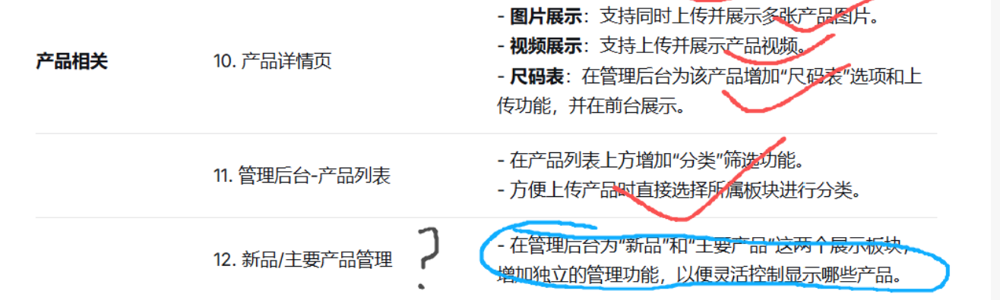

## 新品和主要产品功能 API 文档

---



## 第一部分：管理接口

> ⚠️ **注意**: 以下接口需要JWT认证，用于后台管理系统。

## 1. 新品管理接口

### 1.1 分页查询新品列表
**请求方式**: `POST`
**接口地址**: `/api/new-products`
**是否需要认证**: 是

**功能描述**: 分页获取新品列表，支持分类、状态、关键词筛选

**请求参数**:
```json
{
  "page": 0,
  "size": 10,
  "category": "服装",
  "status": 1,
  "keyword": "搜索关键词"
}
```

**参数说明**:
- `page` (Integer): 页码，从0开始，默认为0
- `size` (Integer): 每页大小，默认为10
- `category` (String): 产品分类过滤（可选）
- `status` (Integer): 产品状态过滤（可选，0-下架，1-上架，2-草稿）
- `keyword` (String): 搜索关键词（可选）

**请求示例**:
```bash
curl -X POST http://localhost:33380/api/new-products \
  -H "Authorization: Bearer your-jwt-token" \
  -H "Content-Type: application/json" \
  -d '{
    "page": 0,
    "size": 10,
    "category": "服装",
    "status": 1
  }'
```

**响应示例**:
```json
{
  "code": 200,
  "message": "查询成功",
  "data": {
    "content": [
      {
        "id": 1,
        "productName": "新品牛仔裤",
        "productCode": "NEW-001",
        "category": "服装",
        "price": 299.00,
        "isNew": true,
        "status": 1,
        "createTime": "2025-11-21T10:00:00"
      }
    ],
    "totalElements": 1,
    "totalPages": 1,
    "size": 10,
    "number": 0
  },
  "timestamp": "2025-11-21T10:00:00"
}
```

### 1.2 获取有效新品列表
**请求方式**: `GET`
**接口地址**: `/api/new-products/active`
**是否需要认证**: 是

**功能描述**: 获取所有有效状态的新品产品列表

**请求示例**:
```bash
curl -X GET http://localhost:33380/api/new-products/active \
  -H "Authorization: Bearer your-jwt-token"
```

**响应示例**:
```json
{
  "code": 200,
  "message": "获取成功",
  "data": [
    {
      "id": 1,
      "productName": "新品牛仔裤",
      "productCode": "NEW-001",
      "category": "服装",
      "price": 299.00,
      "isNew": true,
      "status": 1,
      "createTime": "2025-11-21T10:00:00"
    }
  ],
  "timestamp": "2025-11-21T10:00:00"
}
```

### 1.3 设置产品为新品
**请求方式**: `PUT`
**接口地址**: `/api/new-products/{id}`
**是否需要认证**: 是

**功能描述**: 将指定产品设置为新品

**路径参数**:
- `id` (Long): 产品ID

**请求示例**:
```bash
curl -X PUT http://localhost:33380/api/new-products/1 \
  -H "Authorization: Bearer your-jwt-token"
```

**响应示例**:
```json
{
  "code": 200,
  "message": "设置成功",
  "data": {
    "id": 1,
    "productName": "新品牛仔裤",
    "productCode": "NEW-001",
    "isNew": true,
    "updateTime": "2025-11-21T10:00:00"
  },
  "timestamp": "2025-11-21T10:00:00"
}
```

### 1.4 取消产品新品标识
**请求方式**: `DELETE`
**接口地址**: `/api/new-products/{id}`
**是否需要认证**: 是

**功能描述**: 取消指定产品的新品标识

**路径参数**:
- `id` (Long): 产品ID

**请求示例**:
```bash
curl -X DELETE http://localhost:33380/api/new-products/1 \
  -H "Authorization: Bearer your-jwt-token"
```

### 1.5 批量设置产品为新品
**请求方式**: `PUT`
**接口地址**: `/api/new-products/batch`
**是否需要认证**: 是

**功能描述**: 批量将多个产品设置为新品

**请求参数**:
```json
[1, 2, 3]
```

**请求示例**:
```bash
curl -X PUT http://localhost:33380/api/new-products/batch \
  -H "Authorization: Bearer your-jwt-token" \
  -H "Content-Type: application/json" \
  -d '[1, 2, 3]'
```

### 1.6 批量取消产品新品标识
**请求方式**: `DELETE`
**接口地址**: `/api/new-products/batch`
**是否需要认证**: 是

**功能描述**: 批量取消多个产品的新品标识

**请求参数**:
```json
[1, 2, 3]
```

**请求示例**:
```bash
curl -X DELETE http://localhost:33380/api/new-products/batch \
  -H "Authorization: Bearer your-jwt-token" \
  -H "Content-Type: application/json" \
  -d '[1, 2, 3]'
```

### 1.7 获取新品统计信息
**请求方式**: `GET`
**接口地址**: `/api/new-products/statistics`
**是否需要认证**: 是

**功能描述**: 获取新品的统计信息，包括总数、分类分布等

**请求示例**:
```bash
curl -X GET http://localhost:33380/api/new-products/statistics \
  -H "Authorization: Bearer your-jwt-token"
```

**响应示例**:
```json
{
  "code": 200,
  "message": "获取成功",
  "data": {
    "totalNewProducts": 15,
    "activeNewProducts": 12,
    "inactiveNewProducts": 3,
    "categories": [
      {"name": "服装", "count": 8},
      {"name": "配饰", "count": 4}
    ]
  },
  "timestamp": "2025-11-21T10:00:00"
}
```

---

## 2. 主要产品管理接口

### 2.1 分页查询主要产品列表
**请求方式**: `POST`
**接口地址**: `/api/main-products`
**是否需要认证**: 是

**功能描述**: 分页获取主要产品列表，支持分类、状态、关键词筛选

**请求参数**:
```json
{
  "page": 0,
  "size": 10,
  "category": "服装",
  "status": 1,
  "keyword": "搜索关键词"
}
```

**请求示例**:
```bash
curl -X POST http://localhost:33380/api/main-products \
  -H "Authorization: Bearer your-jwt-token" \
  -H "Content-Type: application/json" \
  -d '{
    "page": 0,
    "size": 10,
    "category": "服装",
    "status": 1
  }'
```

**响应示例**:
```json
{
  "code": 200,
  "message": "查询成功",
  "data": {
    "content": [
      {
        "id": 1,
        "productName": "主打产品牛仔裤",
        "productCode": "MAIN-001",
        "category": "服装",
        "price": 399.00,
        "isMain": true,
        "status": 1,
        "createTime": "2025-11-21T10:00:00"
      }
    ],
    "totalElements": 1,
    "totalPages": 1,
    "size": 10,
    "number": 0
  },
  "timestamp": "2025-11-21T10:00:00"
}
```

### 2.2 获取有效主要产品列表
**请求方式**: `GET`
**接口地址**: `/api/main-products/active`
**是否需要认证**: 是

**功能描述**: 获取所有有效状态的主要产品列表

**请求示例**:
```bash
curl -X GET http://localhost:33380/api/main-products/active \
  -H "Authorization: Bearer your-jwt-token"
```

### 2.3 设置产品为主要产品
**请求方式**: `PUT`
**接口地址**: `/api/main-products/{id}`
**是否需要认证**: 是

**功能描述**: 将指定产品设置为主要产品

**路径参数**:
- `id` (Long): 产品ID

**请求示例**:
```bash
curl -X PUT http://localhost:33380/api/main-products/1 \
  -H "Authorization: Bearer your-jwt-token"
```

### 2.4 取消产品主要产品标识
**请求方式**: `DELETE`
**接口地址**: `/api/main-products/{id}`
**是否需要认证**: 是

**功能描述**: 取消指定产品的主要产品标识

**路径参数**:
- `id` (Long): 产品ID

**请求示例**:
```bash
curl -X DELETE http://localhost:33380/api/main-products/1 \
  -H "Authorization: Bearer your-jwt-token"
```

### 2.5 批量设置产品为主要产品
**请求方式**: `PUT`
**接口地址**: `/api/main-products/batch`
**是否需要认证**: 是

**功能描述**: 批量将多个产品设置为主要产品

**请求参数**:
```json
[1, 2, 3]
```

**请求示例**:
```bash
curl -X PUT http://localhost:33380/api/main-products/batch \
  -H "Authorization: Bearer your-jwt-token" \
  -H "Content-Type: application/json" \
  -d '[1, 2, 3]'
```

### 2.6 批量取消产品主要产品标识
**请求方式**: `DELETE`
**接口地址**: `/api/main-products/batch`
**是否需要认证**: 是

**功能描述**: 批量取消多个产品的主要产品标识

**请求参数**:
```json
[1, 2, 3]
```

**请求示例**:
```bash
curl -X DELETE http://localhost:33380/api/main-products/batch \
  -H "Authorization: Bearer your-jwt-token" \
  -H "Content-Type: application/json" \
  -d '[1, 2, 3]'
```

### 2.7 获取主要产品统计信息
**请求方式**: `GET`
**接口地址**: `/api/main-products/statistics`
**是否需要认证**: 是

**功能描述**: 获取主要产品的统计信息，包括总数、分类分布等

**请求示例**:
```bash
curl -X GET http://localhost:33380/api/main-products/statistics \
  -H "Authorization: Bearer your-jwt-token"
```

**响应示例**:
```json
{
  "code": 200,
  "message": "获取成功",
  "data": {
    "totalMainProducts": 20,
    "activeMainProducts": 18,
    "inactiveMainProducts": 2,
    "categories": [
      {"name": "服装", "count": 12},
      {"name": "配饰", "count": 6}
    ]
  },
  "timestamp": "2025-11-21T10:00:00"
}
```

---

## 第二部分：前端公开展示接口

> ⚠️ **注意**: 以下接口为公开访问，无需JWT认证，专用于前端网站和移动应用展示。

## 3. 公开产品展示接口

### 3.1 获取新品产品列表
**请求方式**: `GET`
**接口地址**: `/api/public/products/new`
**是否需要认证**: 否

**功能描述**: 获取上架的新品产品列表，仅返回上架状态的新品产品

**请求参数**:
| 参数名 | 类型 | 必填 | 默认值 | 说明 |
|--------|------|------|--------|------|
| page | Integer | 否 | 1 | 页码（从1开始） |
| size | Integer | 否 | 20 | 每页数量 |

**特性**:
- 仅返回上架状态的新品产品（status=1且isNew=true）
- 按 `sortOrder` 升序排序（数值越小越靠前）
- 相同排序值时按 `createTime` 降序排序（最新创建的在前）

**请求示例**:
```bash
curl -X GET "http://localhost:33380/api/public/products/new?page=1&size=20"
```

**响应示例**:
```json
{
  "code": 200,
  "message": "获取成功",
  "data": {
    "content": [
      {
        "id": 1,
        "productName": "2024春季新款连衣裙",
        "productCode": "DRESS-2024-001",
        "description": "新款时尚连衣裙，采用优质面料",
        "category": "连衣裙",
        "price": 299.00,
        "marketPrice": 399.00,
        "mainImage": "https://example.com/image1.jpg",
        "productImages": ["https://example.com/image1.jpg", "https://example.com/image2.jpg"],
        "videoPath": "https://example.com/product-video1.mp4",
        "status": 1,
        "isFeatured": false,
        "isNew": true,
        "isMain": false,
        "sortOrder": 1,
        "createTime": "2025-11-21T10:30:00",
        "updateTime": "2025-11-21T10:30:00",
        "tags": ["新品", "时尚"],
        "material": "纯棉",
        "fabricType": "丝绸",
        "style": "优雅"
      }
    ],
    "totalElements": 50,
    "totalPages": 3,
    "size": 20,
    "number": 0,
    "first": true,
    "last": false
  },
  "timestamp": "2025-11-21T10:30:00"
}
```

### 3.2 获取主要产品列表
**请求方式**: `GET`
**接口地址**: `/api/public/products/main`
**是否需要认证**: 否

**功能描述**: 获取上架的主要产品列表，仅返回上架状态的主要产品

**请求参数**:
| 参数名 | 类型 | 必填 | 默认值 | 说明 |
|--------|------|------|--------|------|
| page | Integer | 否 | 1 | 页码（从1开始） |
| size | Integer | 否 | 20 | 每页数量 |

**特性**:
- 仅返回上架状态的主要产品（status=1且isMain=true）
- 按 `sortOrder` 升序排序（数值越小越靠前）
- 相同排序值时按 `createTime` 降序排序（最新创建的在前）

**请求示例**:
```bash
curl -X GET "http://localhost:33380/api/public/products/main?page=1&size=20"
```

**响应示例**:
```json
{
  "code": 200,
  "message": "获取成功",
  "data": {
    "content": [
      {
        "id": 2,
        "productName": "经典商务西装套装",
        "productCode": "SUIT-2024-001",
        "description": "高端商务西装，适合正式场合",
        "category": "西装",
        "price": 1299.00,
        "marketPrice": 1599.00,
        "mainImage": "https://example.com/suit1.jpg",
        "productImages": ["https://example.com/suit1.jpg", "https://example.com/suit2.jpg"],
        "videoPath": "https://example.com/suit-video1.mp4",
        "status": 1,
        "isFeatured": true,
        "isNew": false,
        "isMain": true,
        "sortOrder": 1,
        "createTime": "2025-11-21T09:20:00",
        "updateTime": "2025-11-21T09:20:00",
        "tags": ["商务", "经典"],
        "material": "羊毛",
        "fabricType": "羊毛面料",
        "style": "正式"
      }
    ],
    "totalElements": 25,
    "totalPages": 2,
    "size": 20,
    "number": 0,
    "first": true,
    "last": false
  },
  "timestamp": "2025-11-21T09:20:00"
}
```

### 3.3 获取所有产品（其他公开接口）

**获取所有产品**: `GET /api/public/products` - 分页获取所有产品（不限状态）
**按分类获取产品**: `GET /api/public/products/category/{category}` - 根据分类分页获取产品
**获取产品分类**: `GET /api/public/products/categories` - 获取所有有效的产品分类
**搜索产品**: `GET /api/public/products/search` - 根据关键词搜索产品
**获取产品详情**: `GET /api/public/products/{id}` - 根据产品ID获取产品详情

---

## 4. 注意事项

1. **新品和主要产品标识相互独立**，一个产品可以同时是新品和主要产品
2. **批量操作时**，如果部分产品ID不存在，操作会跳过这些产品，继续处理其他产品
3. **所有删除操作**（设置标识为false）都是逻辑删除，不会真的删除产品数据
4. **统计信息实时计算**，反映当前数据库中的实际状态
5. **公开展示接口安全**：公开接口仅返回展示所需信息，不包含管理相关字段，确保数据安全
6. **公开展示无需认证**：公开展示接口（/api/public/products/*）无需用户登录即可访问
7. **实时数据**：公开展示接口直接从数据库获取最新数据，保证信息的实时性
8. **图片和视频URL**：所有产品相关接口都返回完整的媒体信息，包括主图（mainImage）、图片列表（productImages）和视频路径（videoPath）
9. **媒体URL处理**：productImages字段返回URL数组，videoPath可能为空，前端需要做相应的判空处理
10. **认证要求**: 管理端接口需要JWT Bearer Token认证，公开展示接口无需认证
11. **分页参数**: 分页查询中，管理端page从0开始，前端公开展示page从1开始
12. **数据过滤**: 公开展示接口仅返回上架状态（status=1）的产品，确保前端只看到有效的产品

---

## 5. 接口总结

### 5.1 接口数量统计

| 模块 | 接口数量 | 认证要求 | 说明 |
|------|----------|----------|------|
| 新品管理模块 | 7个 | 需要 | 后台管理 |
| 主要产品管理模块 | 7个 | 需要 | 后台管理 |
| 公开展示模块 | 2个 | 无需 | 前端展示 |
| **总计** | **16个** | **14个需认证** | **完整功能** |

### 5.2 主要功能特性

**后台管理功能**:
- ✅ 产品可设置为新品和主要产品
- ✅ 单独的新品管理模块（7个接口）
- ✅ 单独的主要产品管理模块（7个接口）
- ✅ 完整的批量操作和统计功能
- ✅ 统一的响应格式和错误处理
- ✅ 支持分页、搜索、分类筛选

**前端公开展示功能**:
- ✅ 无需认证的新品产品公开展示接口
- ✅ 无需认证的主要产品公开展示接口
- ✅ 完整的产品信息返回（包含新品和主要产品标识）
- ✅ 支持分页查询和排序
- ✅ 专用于前端网站和移动应用展示
- ✅ 完整的服装专业属性支持（37个字段）

